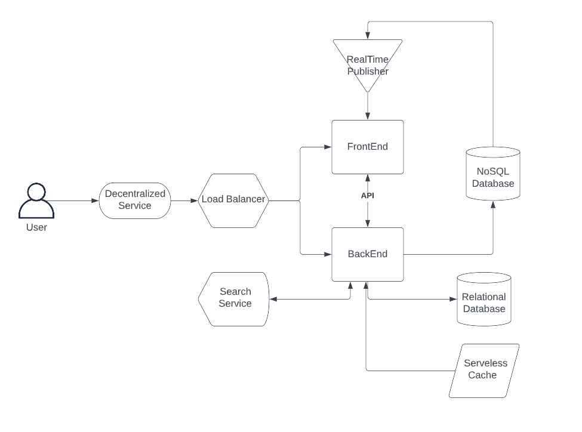
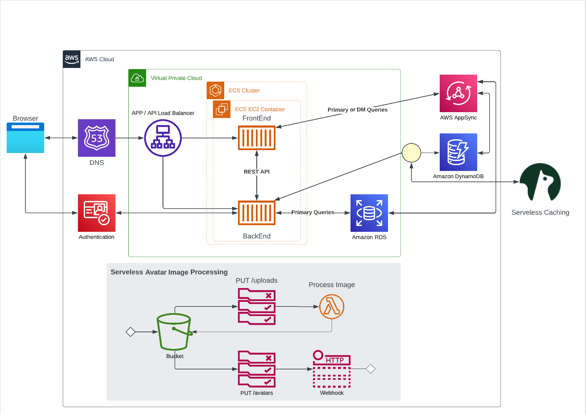
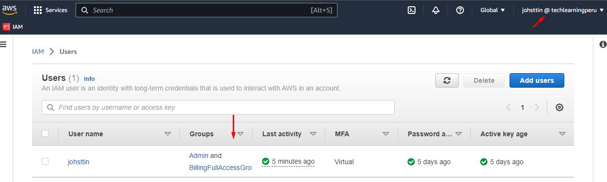
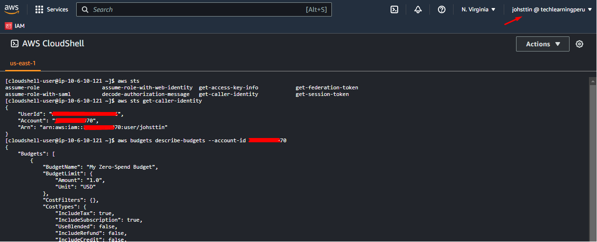
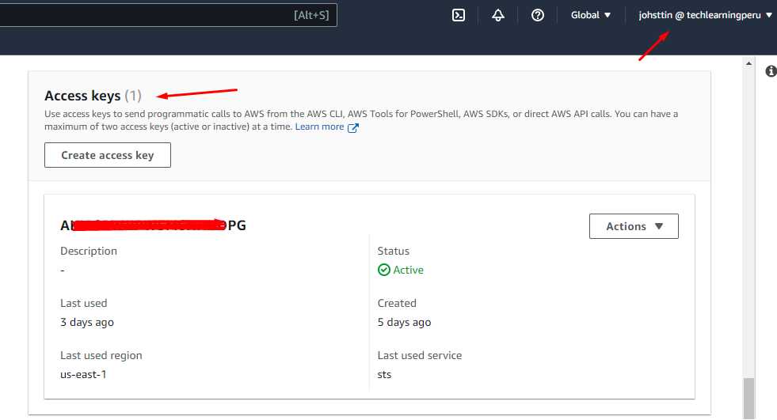

# Week 0 — Billing and Architecture

## Required Homework/Tasks

### Recreate Conceptual Diagram

[Conceptual Diagram Share Link](https://lucid.app/lucidchart/6a6098a8-39e1-4084-a3e2-c0a25dd4ab0a/edit?viewport_loc=-216%2C-61%2C1363%2C1521%2C0_0&invitationId=inv_1a68c651-46e9-4b58-aca9-8b2b56acab02
)

### Recreate Logical Architectual Diagram

[Logical Architectual Diagram Share Link](https://lucid.app/lucidchart/6cc4a218-117e-451c-b92c-df397c451418/edit?viewport_loc=-531%2C-91%2C1363%2C1521%2C0_0&invitationId=inv_2f96516e-e0a0-4de4-b963-90ac7c5238c1
)

### Create an Admin User

I created a An Admin User called johsttin and joined to the Admin Group, I also actived MFA

### Use CloudShell

I used some comands in AWS CloudShell

### Generate AWS Credentials

