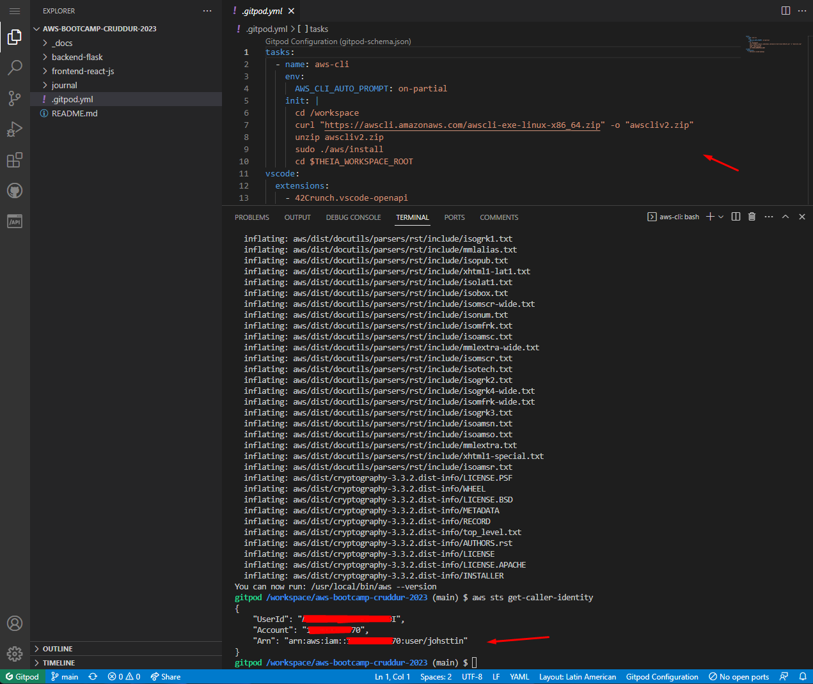
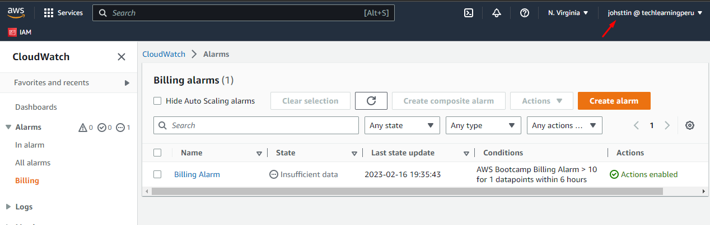
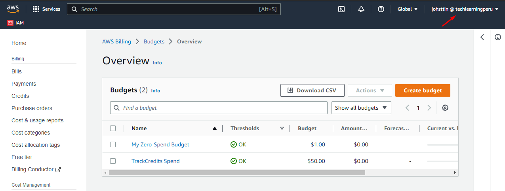
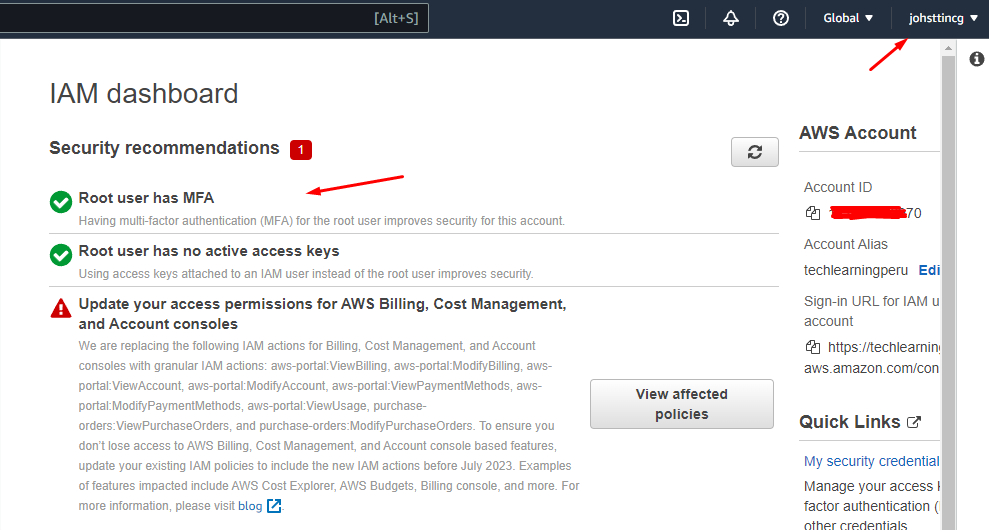
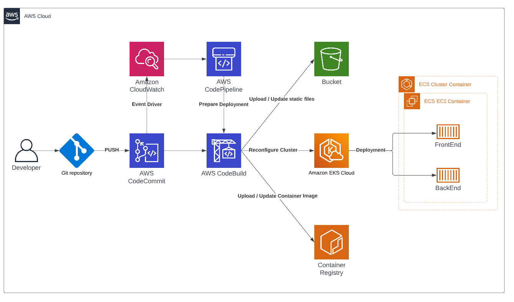
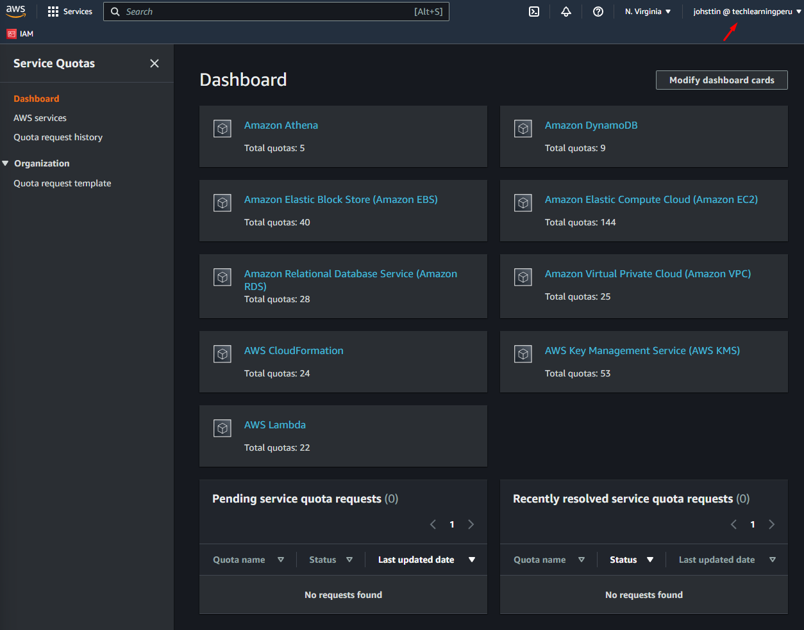
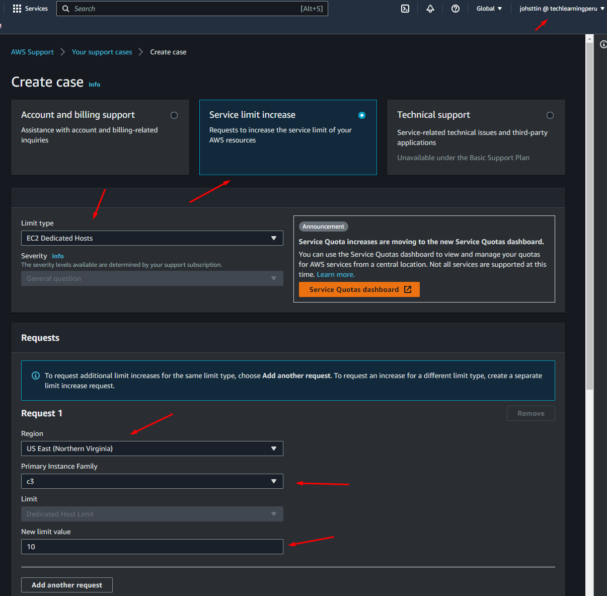
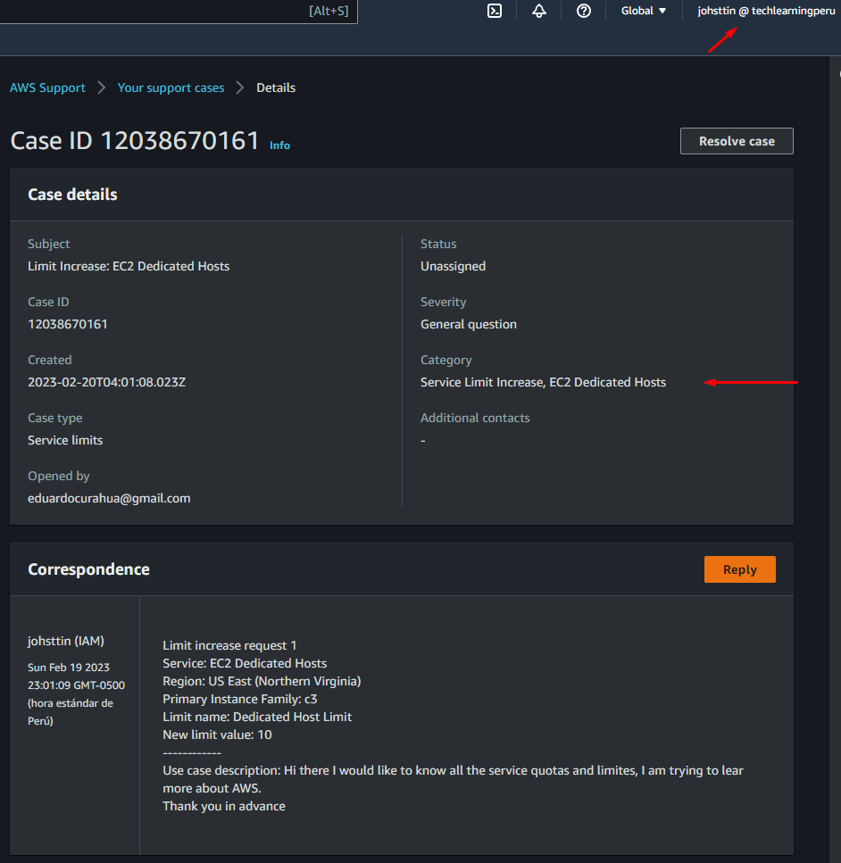

# Week 0 — Billing and Architecture

## Required Homework/Tasks

### Recreate Conceptual Diagram

[Conceptual Diagram Share Link](https://lucid.app/lucidchart/6a6098a8-39e1-4084-a3e2-c0a25dd4ab0a/edit?viewport_loc=-216%2C-61%2C1363%2C1521%2C0_0&invitationId=inv_1a68c651-46e9-4b58-aca9-8b2b56acab02
)

### Recreate Logical Architectual Diagram

[Logical Architectual Diagram Share Link](https://lucid.app/lucidchart/6cc4a218-117e-451c-b92c-df397c451418/edit?viewport_loc=-531%2C-91%2C1363%2C1521%2C0_0&invitationId=inv_2f96516e-e0a0-4de4-b963-90ac7c5238c1
)

### Create an Admin User

I created a An Admin User called johsttin and joined to the Admin Group, I also actived MFA

### Use CloudShell

I used some comands in AWS CloudShell

### Generate AWS Credentials

I created an Access Key to be able to use AWS CLI

### Installed AWS CLI

I installed AWS CLI in GitPod and tested it

### Create a Billing Alarm

I created a Billing Alarm as shown in the "AWS Bootcamp Week 0 - Pricing Basics and Free tier" Video

### Create a Budget

I created two Budgets as shown in " Generate Credentials, AWS CLI, Budget and Billing Alarm via CLI" video, one for my AWS Free Tier and the other one for my Credits ($100)

## Homework Challenges

### Destroy your root account credentials, Set MFA, IAM role

I added a MFA to my root account and created an IAM account also with MFA, activated access to Billing from IAM user, created a new IAM role and assigned Billing access through policy, now I can use my IAM account to almost any task and the root account will not be used unless is required for some specific task.

### Use EventBridge to hookup Health Dashboard to SNS and send notification when there is a service health issue.

### Review all the questions of each pillars in the Well Architected Tool (No specialized lens)

### Create an architectural diagram (to the best of your ability) the CI/CD logical pipeline in Lucid Charts

I am barely new with CI/CD, I understand that after a commit there will be an automated deployment of a new version for the Frontend pods or Backend pods and maybe some images that we could be using in S3 Bucket

[CI/CD Logical Pipeline Share Link](https://lucid.app/lucidchart/1b9d3fd5-6c58-418d-9bb5-474c2411a22d/edit?viewport_loc=-233%2C-144%2C3072%2C1535%2C0_0&invitationId=inv_7da94d66-1a8c-4698-b684-165ef34dd12c
)

### Research the technical and service limits of specific services and how they could impact the technical path for technical flexibility.

AWS has quotas and service limits, the service limits is a protection to unexpected excessive provisioning with this AWS protect to increase your bill from malicious actions or mistakes in deployment, this would be a problem if you reach the service limit and you still need more Compute Resource but you can just open a ticket requesting a service limit increase, You can monitor your quotas in the Service Quotas Dashboard

### Open a support ticket and request a service limit

