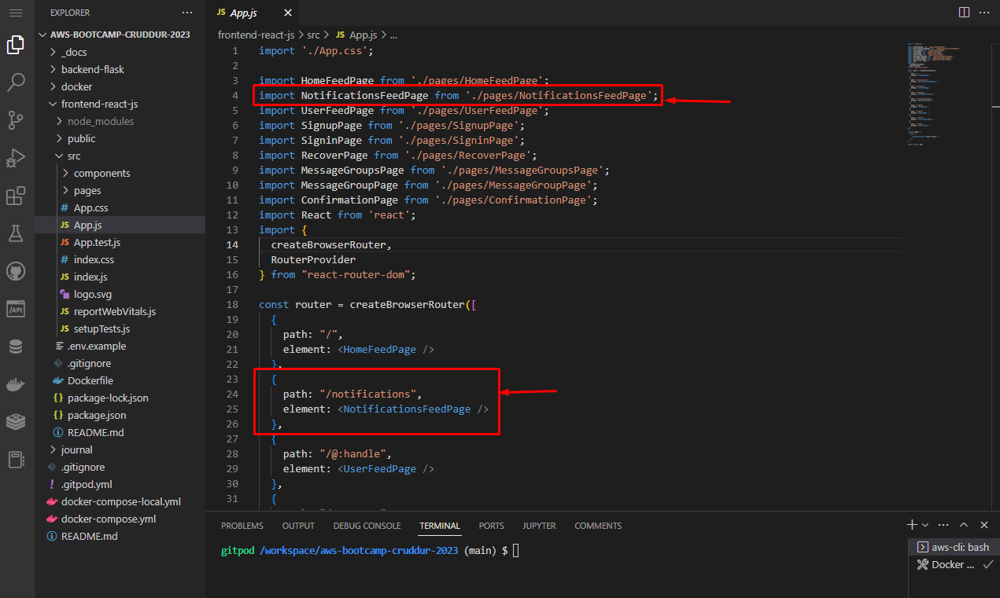

# Week 1 — App Containerization
## Required Homework 
### Containerize Application (Dockerfiles, Docker Compose)

Backend  Image from Dockerfile

Backend Container

Backend Test

Frontend  Image from Dockerfile

Docker Compose for Frontend and Backend containers

Frontend and Backend Test

### Document the Notification Endpoint for the OpenAI Document

### Write a Flask Backend Endpoint for Notifications

!Backend Flask 2](assets/BackendFlask2.png)

### Write a React Page for Notifications

Notification Test

### Run DynamoDB Local Container and ensure it works

### Run Postgres Container and ensure it works
