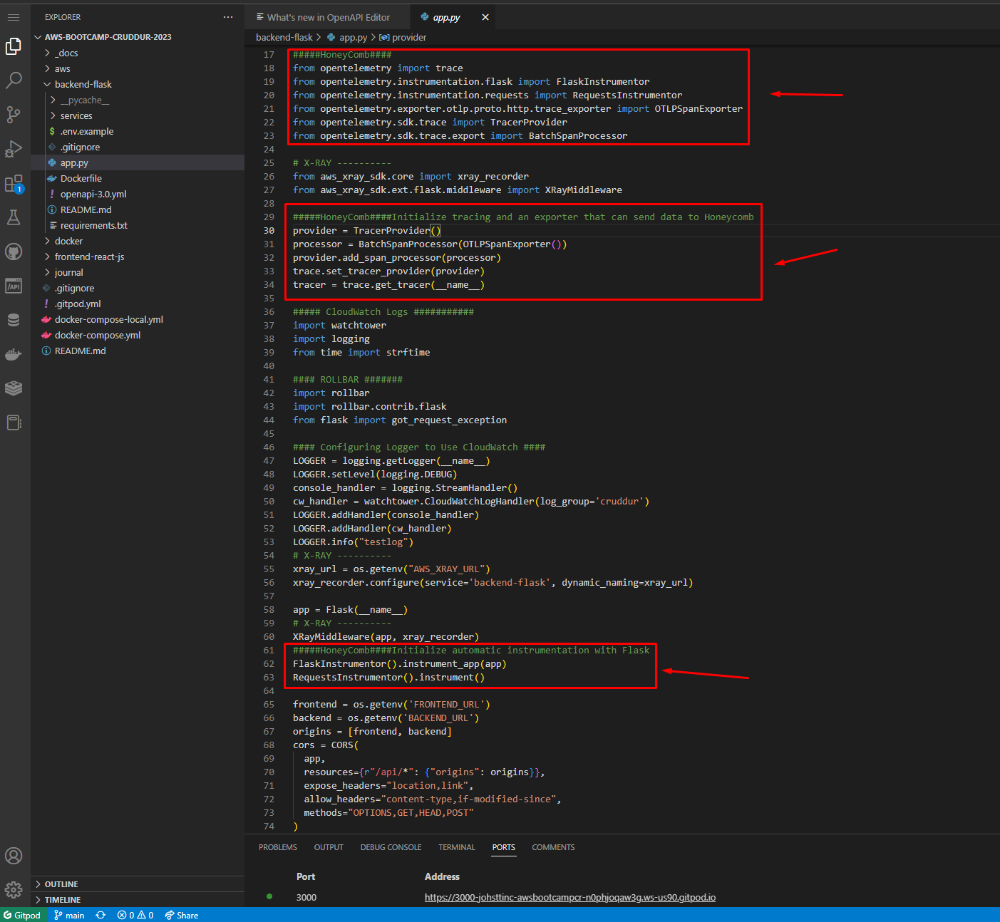
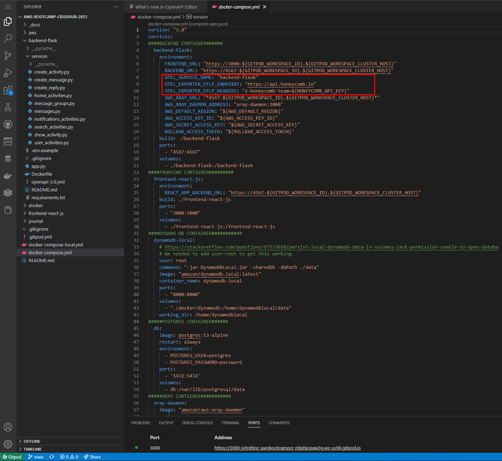
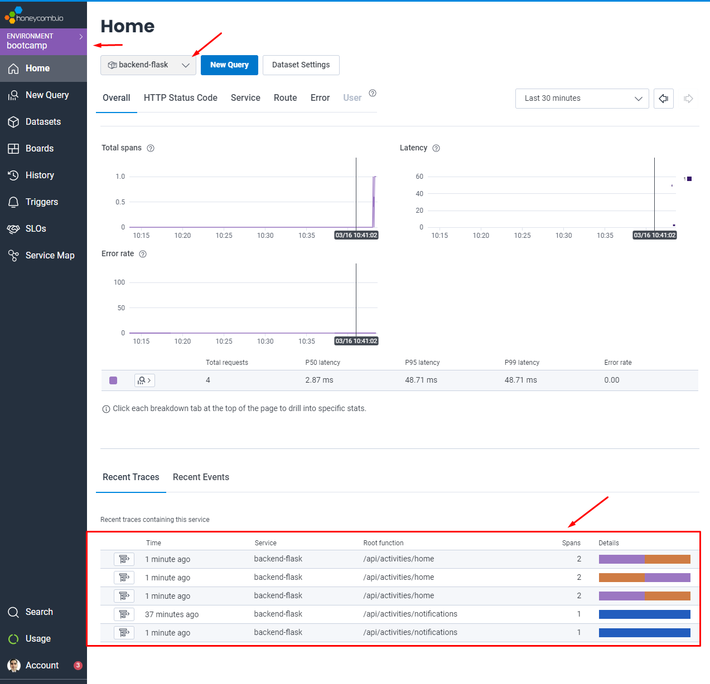
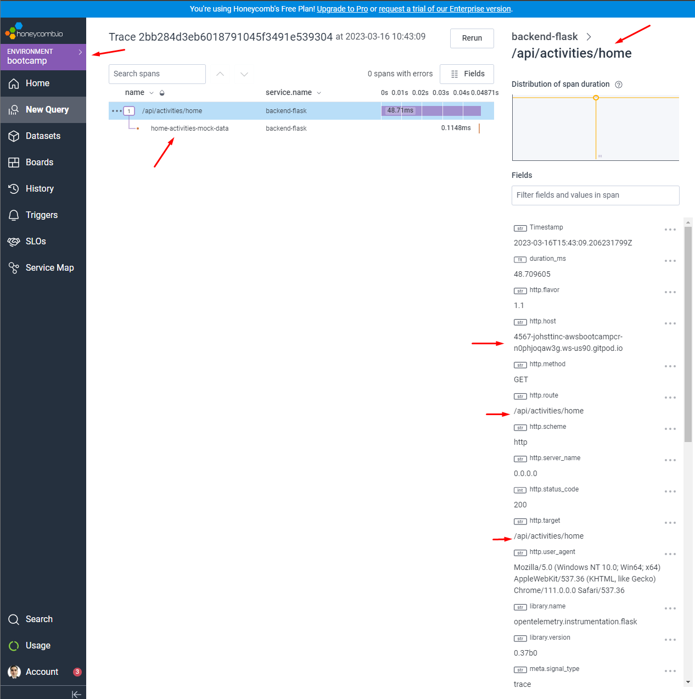
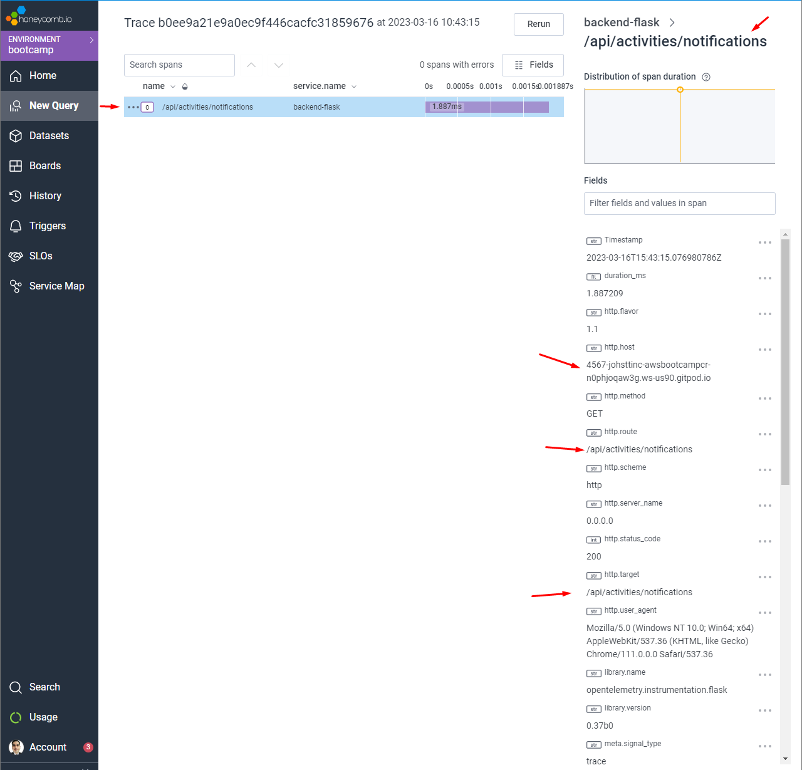

# Week 2 — Distributed Tracing
## Required Homework

Editing file app.py, docker-compose.yml and home-activities.py

Testing HoneyComb

### Instrument Honeycomb with OTEL

### Instrument AWS X-Ray

### Instrument AWS X-Ray Subsegments

### Configure custom logger to send to CloudWatch Logs

### Integrate Rollbar and capture and error

