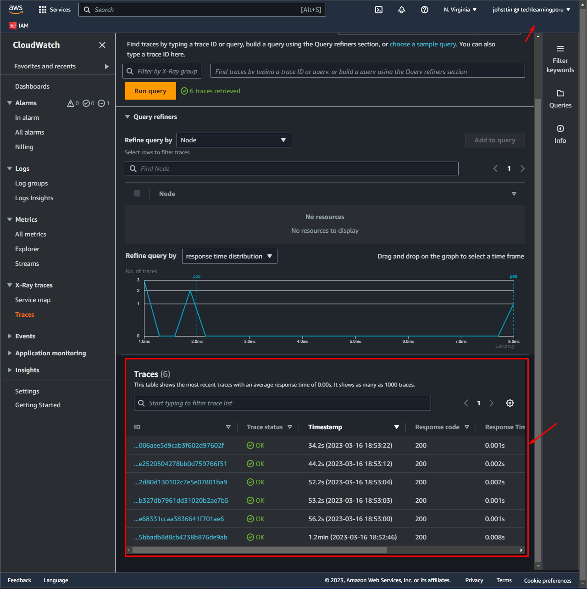

# Week 2 — Distributed Tracing
## Required Homework
### Instrument Honeycomb with OTEL
Editing file app.py, docker-compose.yml and home_activities.py

Testing HoneyComb

### Instrument AWS X-Ray

Editing file app.py and docker-compose.yml

Testing XRAY

### Instrument AWS X-Ray Subsegments

Editing file user_activities.py

Testing XRAY subsegments

### Configure custom logger to send to CloudWatch Logs

Editing file app.py and home_activities.yml

Testing CloudWatch Logs

### Integrate Rollbar and capture and error

